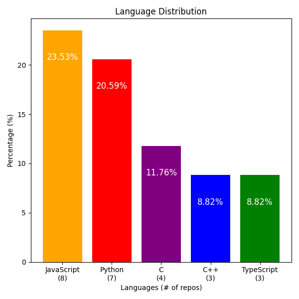

<h3 align="center">
    Hi there 👋
</h3>

 My name is Mika!  I am a Junior at UCSC, working towards a B.S. in Computer Science: Game Design and a B.S. in Cognitive Science. 

<h3 align="center"> Projects/Skills: </h3>

  
<i> <b> [current language distribution of my repos] </b> </i>

Throughout my academic career, I gained experiences in a variety of languages!

- `C/C++`
  - Used in advanced programming classes, where I worked on projects such as [huffman tree](https://github.com/MikaPS/HuffmanCoding), [RSA encryption](https://github.com/MikaPS/PublicKeyCryptography), and a [client/server communication using multithreading and state machines](https://github.com/MikaPS/StateRobot)
  - Used a `Linux virtual machine`, `bash`, and the `command line`
- `C# and Unity Engine`
  - developed [interactive projects](https://drive.google.com/drive/folders/1nnsbGRtWIObr23qRMANhiI0fOyII8Pnf) incoprating AI algorithms, optimization, and user-centric Design.
- `Matlab`
  - I am working as a reserach assistant at the High Level Perception Lab at UCSC where I am integrating an eye-tracking software (Gazepoint API) into Matlab
- `TypeScript/JavaScript/HTML/CSS`
  - Utilization of `Vite PWA plug-in` to support offline web and mobile [play](https://github.com/MikaPS/GardenSimulator2023).
  - Incorporation of `internal and external DSLs` and an auto-save functionality.
  - `Localization` to 3 languages with a switchable `internationalization`
  - Displaying real-life location data of users on a [map](https://github.com/MikaPS/cmpm-121-demo-3) (`Leaflet library`)
  - Using Build platforms (`vite`) and frameworks (`Phaser`)
- `Python`:
  - A web scraping tool with GUI (used `requests`, `bs4`, and `tkinter`)
  - A machine learning framework (an autogradient framework with a custom loss function to enhance a given model)
  - A recursive algorithm that can solve 1,000 complex sudoku problems in less than 30 seconds.

<!--  -->

<!--
**MikaPS/MikaPS** is a ✨ _special_ ✨ repository because its `README.md` (this file) appears on your GitHub profile.

Here are some ideas to get you started:

- 🔭 I’m currently working on ...
- 🌱 I’m currently learning ...
- 👯 I’m looking to collaborate on ...
- 🤔 I’m looking for help with ...
- 💬 Ask me about ...
- 📫 How to reach me: ...
- 😄 Pronouns: ...
- ⚡ Fun fact: ...
-->
